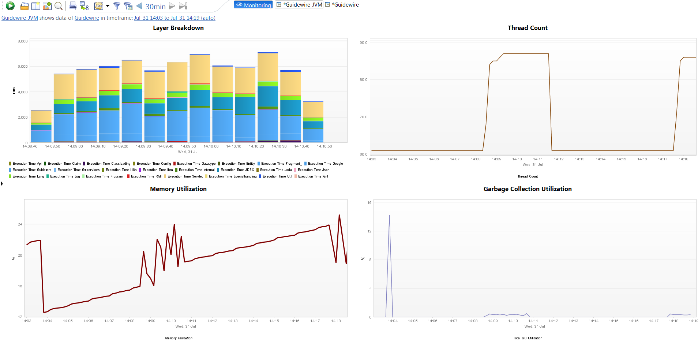

# Guidewire FastPack

Overview

 The dynaTrace FastPack for Guidewire Claim Center enables deep
insight into the Guidewire Claim Center Application Server and the enclosing platform. This FastPack provides essential metrics which are visualized on different dashboards including Claim Center
Business Transactions such as Claim Number and User Login

.

## Fast Pack Details

| Name | Guidewire FastPack
| :--- | :---
| Author |Dan Breslin ([dan.breslin@compuware.com](mailto:dan.breslin@compuware.com))
| Supported dynaTrace Versions | >= 5.5
| License | [dynaTrace BSD](dynaTraceBSD.txt)
| Support | [dan.breslin@compuware.com](mailto:dan.breslin@compuware.com)
| Known Problems |Although dynaTrace also supports Guidewire Policy Center and Billing Center, this fastpack is limited to Claim Center. For information on Billing Center or Policy Center contact [dan.breslin@compuware.com](mailto:dan.breslin@compuware.com)
| Release History | August 2013 Initial Release
| |October 2013 - Additional Business Transactions for Username and Event Source
| Download | [Guidewire.dtp](Guidewire.dtp)

## Content

The following components are part of this FastPack:

### Guidewire System Profile

The reference Guidewire System Profile contains a set of basic metrics required by the Dashboards of this FastPack for Guidewire Claim Center.

### Guidewire Dashboard

The Guidewire Dashboard gives insight into the Claim Center Overall Performance and Buisiness Transaction volume and response times.

### Guidewire JVM Dashboard

The Guidewire JVM Dashboard gives insight into health and performance of the Claim Center Java Virtual Machne

.

